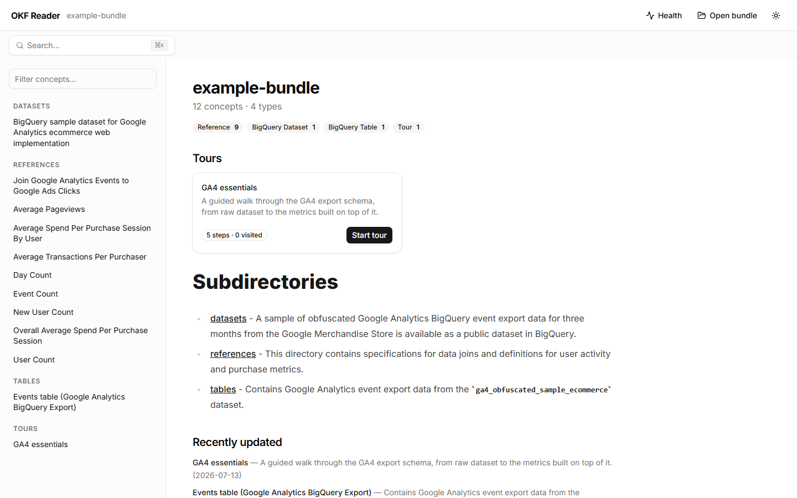
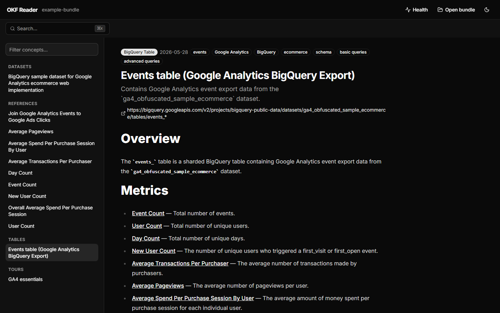
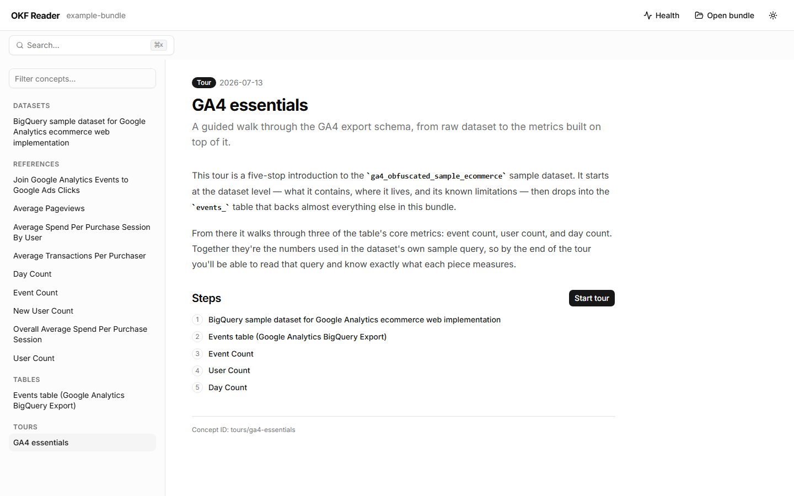
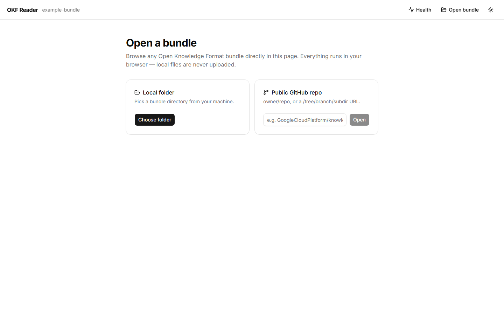

# okf-reader

A static-first reading app for [Open Knowledge Format (OKF)](https://github.com/GoogleCloudPlatform/knowledge-catalog/blob/main/okf/SPEC.md)
knowledge bundles — built for humans, not just agents. Point it at a bundle
directory and it renders a browsable site: sidebar navigation, concept pages
with frontmatter badges, rewired cross-links, backlinks ("cited by"), and a
local-neighborhood connection graph per concept.

Companion to [okf-skill](https://github.com/lorsabyan/okf-skill), the agent
skill for authoring and validating OKF bundles.

Built with Next.js 16, React 19, Tailwind CSS v4, shadcn/ui, and Bun.

|                                        |                                      |
| -------------------------------------- | ------------------------------------ |
|  |  |
|           |         |

**Live demo:** https://lorsabyan.github.io/okf-reader/ — browse the baked-in
GA4 bundle, or hit **Open bundle** to load your own:

- **Local folder** — read directly in the browser via the File System Access
  API (with a `webkitdirectory` fallback). Nothing is uploaded anywhere.
- **Public GitHub repo** — paste `owner/repo` or a
  `github.com/…/tree/branch/subdir` URL; the bundle is fetched client-side
  through the CORS-enabled GitHub Trees API + raw.githubusercontent.com.
  Runtime-mode HTML is sanitized with DOMPurify.

## Features

- **Reading UX** — sidebar navigation grouped by directory, frontmatter
  badges, rewired cross-links, "Cited by" backlinks, and a local-neighborhood
  connection graph per concept.
- **Runtime viewer** (`/open/`) — browse a local folder or public GitHub repo
  entirely client-side, with shareable URLs for GitHub-sourced bundles.
- **Search** — full-text search over the built site via Pagefind
  (<kbd>Ctrl</kbd>/<kbd>⌘</kbd> <kbd>K</kbd>).
- **Health** (`/health/`) — automated checks for broken links, missing
  descriptions, untyped/undated/stale concepts, and orphans.
- **Tours** — guided, ordered walkthroughs of a bundle (frontmatter
  `type: Tour` + `steps`), with a sticky progress bar and per-browser
  progress tracking.

## Run

```sh
bun install
bun run dev            # http://localhost:3000, renders example-bundle/
```

Point at your own bundle:

```sh
OKF_BUNDLE=/path/to/bundle OKF_BUNDLE_NAME="My Catalog" bun run dev
```

## Static export

```sh
bun run build          # writes a fully static site to out/
bun test               # unit tests
bun run typecheck
```

For sub-path hosting (e.g. GitHub Pages), set `NEXT_BASE_PATH=/repo-name`
at build time — see [.github/workflows/deploy.yml](.github/workflows/deploy.yml).

Deploy `out/` to any static host (GitHub Pages, Cloudflare Pages, S3, nginx).
No backend, no database — the bundle stays the source of truth in git,
exactly as OKF intends.

## What it does with the format

- **Navigation** is grouped by the bundle's directory hierarchy, with a
  client-side filter over titles, IDs, types, and tags.
- **Cross-links** (`/tables/x.md`) are rewired to reader routes; links to
  missing concepts render as dashed "not yet written" markers, per the
  spec's tolerance rules.
- **Frontmatter** drives the UI: `type` and `tags` become badges,
  `timestamp` powers the "recently updated" feed, `resource` links out to
  the underlying asset.
- **Backlinks** are computed from the link graph and shown as "Cited by".

## Example bundle

`example-bundle/` is the GA4 e-commerce bundle from
[GoogleCloudPlatform/knowledge-catalog](https://github.com/GoogleCloudPlatform/knowledge-catalog)
(Copyright Google LLC, Apache 2.0), vendored for the out-of-the-box demo.

Note: the baked (SSG) mode renders its bundle without HTML sanitization —
build only bundles you trust, as with any documentation generator. Bundles
opened at runtime via `/open/` are always sanitized with DOMPurify.

## Development

This repo is a Bun workspace: the reader app lives at the root, and the
source-agnostic bundle model + validator CLI live in
[`packages/okf-core`](packages/okf-core) as the `@okf/core` package.

```sh
bun install                 # installs the whole workspace
bun run typecheck           # tsc --noEmit, app + packages
bun test                    # bun:test, app + packages
bun run build               # next build + pagefind, writes out/
bun run e2e                 # Playwright smoke suite against out/ (build first)
bun run screenshots         # regenerate the README screenshots into docs/
```

`@okf/core` also ships `okf-validate`, a v0.1 conformance checker for a
bundle directory (mirrors the reference Python validator in
[okf-skill](https://github.com/lorsabyan/okf-skill)):

```sh
bunx okf-validate example-bundle [--strict]
```

See [CONTRIBUTING.md](CONTRIBUTING.md) for the full dev workflow.

## License

Apache 2.0.
