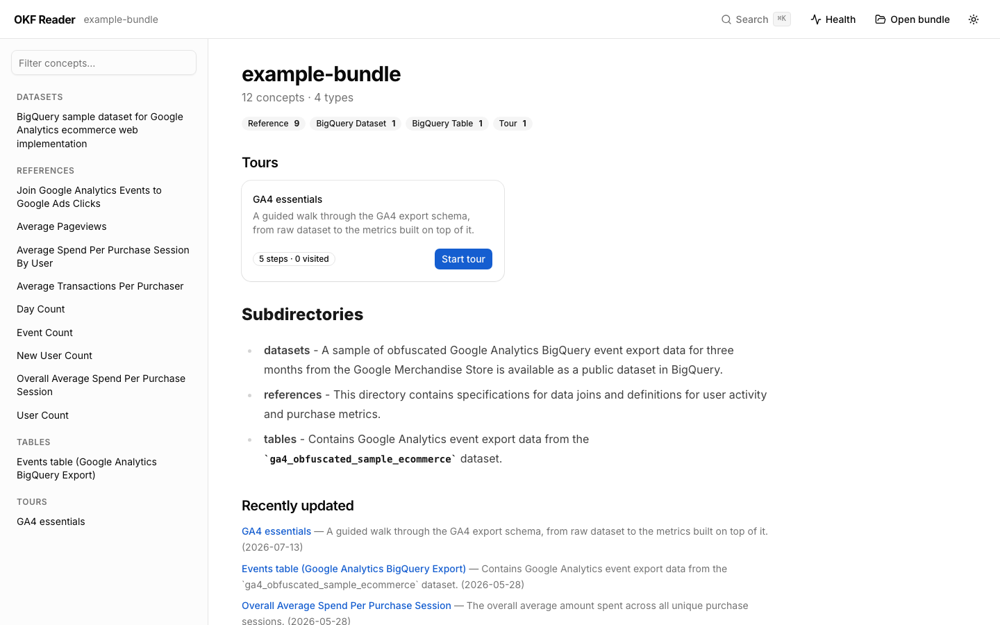
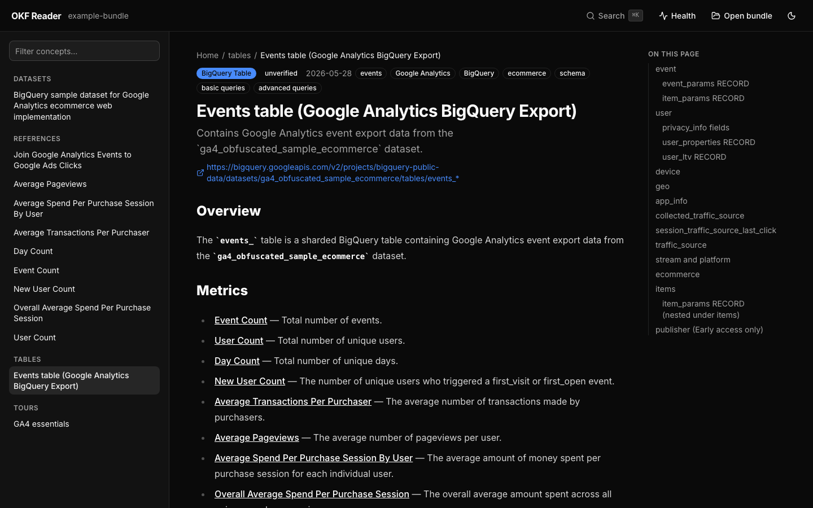
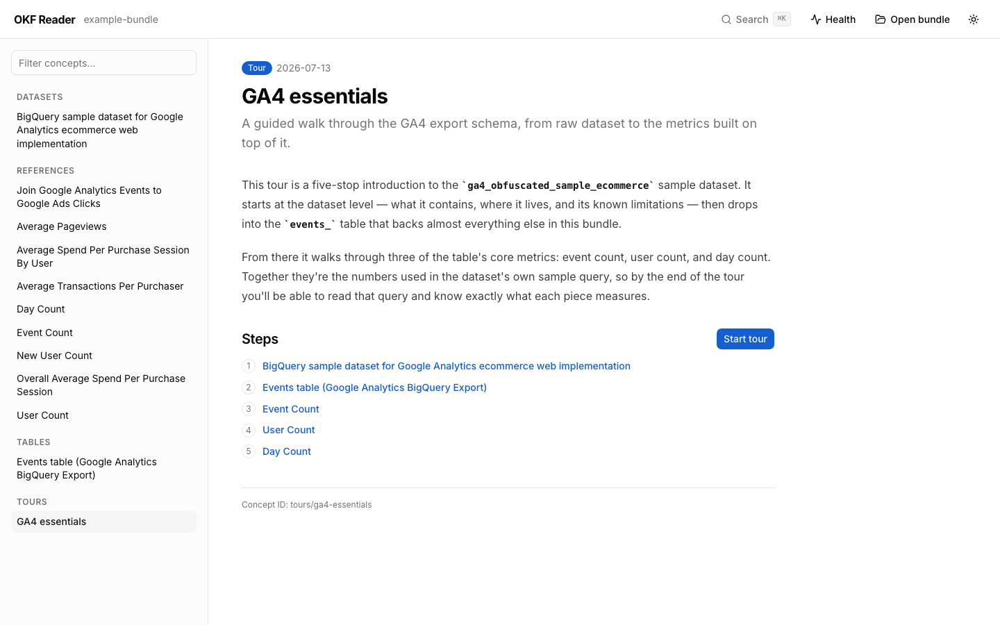
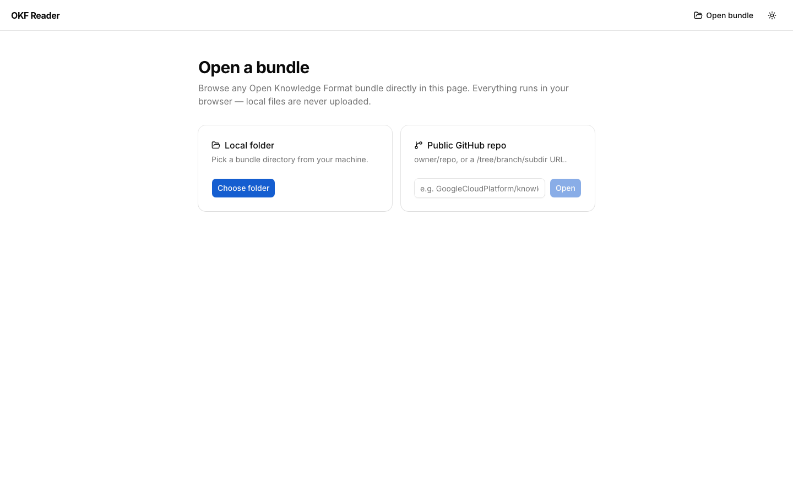

# okf-reader

A static-first reading app for [Open Knowledge Format (OKF)](https://github.com/GoogleCloudPlatform/knowledge-catalog/blob/3fcbb9f/okf/SPEC.md)
knowledge bundles — built for humans, not just agents. Point it at a bundle
directory and it renders a browsable site: sidebar navigation, concept pages
with frontmatter badges, rewired cross-links, backlinks ("cited by"), and a
local-neighborhood connection graph per concept.

Companion to [okf-skill](https://github.com/lorsabyan/okf-skill), the agent
skill for authoring and validating OKF bundles.

Built with Next.js 16, React 19, Tailwind CSS v4, shadcn/ui, and Bun.

|                                        |                                      |
| -------------------------------------- | ------------------------------------ |
|  |  |
|           |         |

**Live demo:** https://lorsabyan.github.io/okf-reader/ — browse the baked-in
GA4 bundle, or hit **Open bundle** to load your own:

- **Local folder** — read directly in the browser via the File System Access
  API (with a `webkitdirectory` fallback). Nothing is uploaded anywhere.
- **Public GitHub repo** — paste `owner/repo` or a
  `github.com/…/tree/branch/subdir` URL; the bundle is fetched client-side
  through the CORS-enabled GitHub Trees API + raw.githubusercontent.com.
  HTML is sanitized as part of the markdown pipeline (rehype-sanitize).

## Features

- **Reading UX** — sidebar navigation grouped by directory, frontmatter
  badges, rewired cross-links, "Cited by" backlinks, and a local-neighborhood
  connection graph per concept.
- **Runtime viewer** (`/open/`) — browse a local folder or public GitHub repo
  entirely client-side, with shareable URLs for GitHub-sourced bundles.
- **Search** — full-text search over the built site via Pagefind
  (<kbd>Ctrl</kbd>/<kbd>⌘</kbd> <kbd>K</kbd>).
- **Health** (`/health/`) — automated checks for broken links, missing
  descriptions, untyped/undated/stale concepts, and orphans.
- **Tours** — guided, ordered walkthroughs of a bundle (frontmatter
  `type: Tour` + `steps`), with a sticky progress bar and per-browser
  progress tracking.

## Run

```sh
bun install
bun run dev            # http://localhost:3000, renders example-bundle/
```

Point at your own bundle:

```sh
OKF_BUNDLE=/path/to/bundle OKF_BUNDLE_NAME="My Catalog" bun run dev
```

## Static export

```sh
bun run build          # writes a fully static site to out/
bun test               # unit tests
bun run typecheck
```

For sub-path hosting (e.g. GitHub Pages), set `NEXT_BASE_PATH=/repo-name`
at build time — see [.github/workflows/deploy.yml](.github/workflows/deploy.yml).

Deploy `out/` to any static host (GitHub Pages, Cloudflare Pages, S3, nginx).
No backend, no database — the bundle stays the source of truth in git,
exactly as OKF intends.

## What it does with the format

- **Navigation** is grouped by the bundle's directory hierarchy, with a
  client-side filter over titles, IDs, types, and tags.
- **Cross-links** (`./tables/x.md`, or the bundle-absolute `/tables/x.md`) are
  rewired to reader routes; links to
  missing concepts render as dashed "not yet written" markers, per the
  spec's tolerance rules.
- **Frontmatter** drives the UI: `type` and `tags` become badges,
  `generated.at` powers the "recently updated" feed (falling back to v0.1's
  `timestamp`), `resource` links out to the underlying asset.
- **Trust and lifecycle** are surfaced from OKF v0.2: `status`, the trust tier
  derived from `verified`, and `stale_after` render as badges; `sources`
  render as a provenance list. An `Attested Computation` shows its contract —
  runtime, parameters, receipt fields, executor and attester.
- **Backlinks** are computed from the link graph and shown as "Cited by".

## Example bundle

`example-bundle/` is the GA4 e-commerce bundle from
[GoogleCloudPlatform/knowledge-catalog](https://github.com/GoogleCloudPlatform/knowledge-catalog)
(Copyright Google LLC, Apache 2.0), vendored for the out-of-the-box demo, with
two deliberate local changes:

- **`tours/ga4-essentials.md` is ours.** Tours are an okf-reader extension —
  `steps` is not an OKF concept — so upstream has none.
- **Its frontmatter was migrated to OKF v0.2 in place** (plan 017): `timestamp`
  became `generated: { by, at }` preserving the original instant, and each
  `# Citations` body list became `sources` entries. Content is otherwise
  untouched.

It is therefore no longer byte-identical to any upstream commit. Upstream
rewrote its own GA4 bundle during its v0.2 migration — different metrics, no
`joins/` — so re-vendoring wholesale would have replaced this bundle's content
and deleted the tour the reader demos. `generated.by` reads
`reference_agent/unknown` on the vendored docs because OKF v0.1 recorded no
producer and upstream's history has none either; that missing field is exactly
what v0.2 added `generated` to fix.

### A second bundle for the v0.2 trust features

`example-bundle-acme-retail/` is upstream's Acme Retail bundle, vendored
**byte-identical** at commit
[`3fcbb9f`](https://github.com/GoogleCloudPlatform/knowledge-catalog/tree/3fcbb9f/okf/bundles/acme_retail)
(Copyright Google LLC, Apache 2.0), minus its `viz.html`.

The GA4 bundle cannot demonstrate OKF v0.2's trust and lifecycle features,
because none of them are true of it — nobody verified that content and nothing
in it is deprecated or expiring, and inventing those signals would put
fabricated provenance inside a provenance format. Acme Retail carries them
honestly:

| | GA4 | Acme Retail |
|---|---|---|
| `verified` | 0 docs | 8 docs (9 human verifiers) |
| `stale_after` | 0 docs | 7 docs |
| `status: deprecated` | 0 docs | 1 doc |
| `type: Attested Computation` | 0 docs | 2 docs |
| `sources` | 11 docs | 5 docs |

Point the reader at it to see trust tiers, deprecation, staleness, provenance,
and computation contracts rendered:

```sh
OKF_BUNDLE=example-bundle-acme-retail OKF_BUNDLE_NAME="Acme Retail" bun run dev
```

It is not the default demo and is not used by the tests or screenshots — the
reader builds one bundle at a time, and `example-bundle/` remains the one it
ships with.

Note: both the baked (SSG) mode and the runtime viewer (`/open/`) sanitize
rendered HTML via the same unified/rehype pipeline (`rehype-sanitize`, a
GitHub-style allowlist extended for cross-link classes, heading anchor ids,
and shiki's syntax-highlighting output) — still build only bundles you trust,
as with any documentation generator, but there's no unsanitized SSG path
anymore.

## Development

This repo is a Bun workspace: the reader app lives at the root, and the
source-agnostic bundle model + validator CLI live in
[`packages/okf-core`](packages/okf-core) as the `@okf/core` package.

```sh
bun install                 # installs the whole workspace
bun run typecheck           # tsc --noEmit, app + packages
bun test                    # bun:test, app + packages
bun run build               # next build + pagefind, writes out/
bun run e2e                 # Playwright smoke suite against out/ (build first)
bun run screenshots         # regenerate the README screenshots into docs/
```

`@okf/core` also ships `okf-validate`, a v0.2 conformance checker for a
bundle directory (mirrors the reference Python validator in
[okf-skill](https://github.com/lorsabyan/okf-skill)):

```sh
bunx okf-validate example-bundle [--strict]
```

See [CONTRIBUTING.md](CONTRIBUTING.md) for the full dev workflow.

## Versioning

Releases are tagged and documented in [CHANGELOG.md](CHANGELOG.md); the
per-batch detail and the reasoning behind each decision live in
[plans/](plans/README.md).

`@okf/core` is versioned in lockstep with the app and is not yet published to
npm. While it is `0.x`, a minor bump may carry breaking API changes — `0.2.0`
does: `HealthReport.stale` changed shape and meaning, and `Concept` gained
non-optional `verified`, `status`, and `sources`.

The version tracks this repo, not the format. They line up at `0.2.x` only
because that release added OKF v0.2 support.

## Publishing `@okf/core`

`.github/workflows/publish.yml` publishes the package on a **published GitHub
release**, using OIDC trusted publishing — no npm token is stored in this repo,
and npm generates provenance attestations automatically.

It is not yet armed. npm attaches a trusted-publisher config to an **existing**
package, so the first publish has to be done by hand:

```sh
cd packages/okf-core && npm publish --access public
```

`--access public` is required — a scoped package defaults to private. Then set
the trusted publisher at npmjs.com → `@okf/core` → Settings → Trusted Publisher
(`lorsabyan` / `okf-reader` / `publish.yml`), and every release after that
publishes from CI.

The workflow refuses to publish unless the release tag matches the manifest
version, `bun run typecheck` and the tests pass, and the shipped README names
the current spec version. `workflow_dispatch` runs a pack-and-verify dry run by
default.

## License

Apache 2.0.
